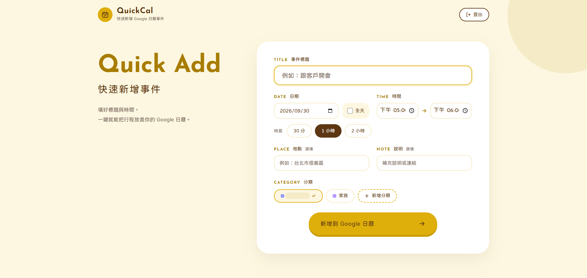
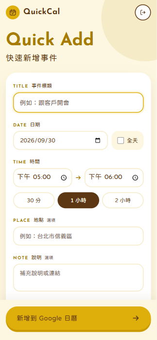
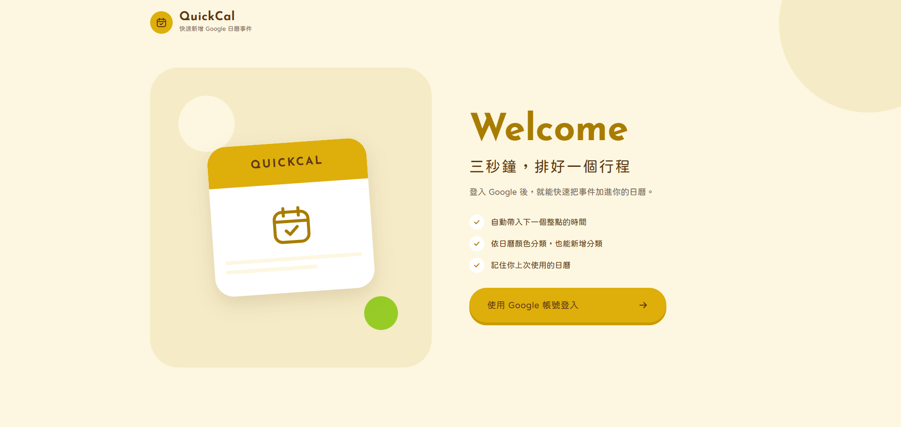
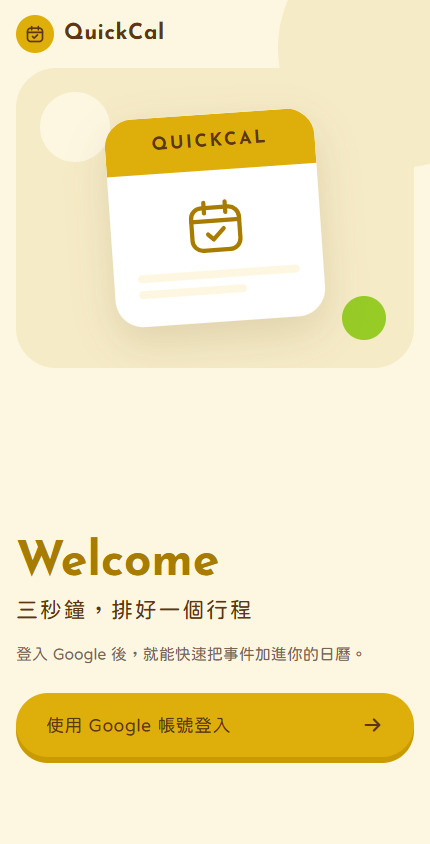

# QuickCal

快速新增 Google 日曆事件的網頁工具（Next.js 16 + Auth.js + Google Calendar API）。

- 標題、日期、時間（自動帶入下一個整點，可一鍵選 30 分／1 小時／2 小時）、地點、說明
- 依日曆顏色選擇分類，也能直接新增分類（建立新的 Google 日曆）
- 記住上次使用的日曆
- 桌面與手機版面

## 開發

```bash
npm install
cp .env.example .env.local   # 填入 Google OAuth 設定
npm run dev                  # http://localhost:3100
```

## Google Cloud 設定

1. 啟用 **Google Calendar API**
2. Google Auth Platform → 目標對象：外部；測試階段需把登入帳號加入 **Test users**
3. 建立「網頁應用程式」OAuth 用戶端：
   - 已授權的 JavaScript 來源：`http://localhost:3100`、`https://<正式網域>`
   - 已授權的重新導向 URI：`http://localhost:3100/api/auth/callback/google`、`https://<正式網域>/api/auth/callback/google`
4. 將 Client ID / Secret 填入 `.env.local`

申請的權限：`calendar.events`（新增事件）、`calendar.calendarlist.readonly`（列出可寫入的日曆）、`calendar.app.created`（新增分類，只能存取 QuickCal 建立的日曆）。

> 同意畫面維持「測試中」時，只有 Test users 名單內的帳號能登入，且 Google 發出的 refresh token 7 天後失效，屆時需重新登入。

## 部署（Vercel）

專案已連接 Vercel，push 到 `main` 會自動部署正式環境，其他 branch 會產生預覽網址。

- 在 Vercel 專案 **Settings → Environment Variables** 設定 `GOOGLE_CLIENT_ID`、`GOOGLE_CLIENT_SECRET`、`AUTH_SECRET`
- 預覽網址每次不同，Google 不接受萬用字元，所以登入只能在已加入重新導向 URI 的正式網址測試

## 畫面設計

溫暖的奶油底配芥末黃重點色，大圓角卡片與膠囊按鈕；標題與欄位標籤採「英文小標＋中文」的雙語寫法。

| 桌面版 | 手機版 |
| --- | --- |
|  |  |
|  |  |

| 用途 | 色彩 | Tailwind |
| --- | --- | --- |
| 背景 | `#FDF7E1` 奶油 | `bg-cream` |
| 裝飾圓、邊框 | `#F5EBC6` 米色 | `bg-beige` / `border-beige` |
| 主要按鈕、選取 | `#DEAE0B` 芥末黃 | `bg-gold` / `border-gold` |
| 英文標題、標籤 | `#A87C00` 深金（對比足夠的文字用色） | `text-gold-ink` |
| 內文 | `#5D3713` 深咖啡 | `text-brown` |
| 次要文字 | `#776656` | `text-muted` |
| 成功 | `#97CC27` 草綠 | `bg-leaf` |

- 字型：中文 [Huninn 粉圓](https://fonts.google.com/specimen/Huninn)（`font-sans`），英文標題與數字 [Josefin Sans](https://fonts.google.com/specimen/Josefin+Sans)（`font-display`）
- 黃色按鈕上用深咖啡字而非白字，確保文字對比
- 手機版（< `lg`）表單為獨立卡片，送出按鈕固定在畫面底部；桌面版左側標題、右側表單卡片
- 色彩與字型定義在 `src/app/globals.css`，共用樣式與元件在 `src/components/ui.tsx`

## 結構

- `src/auth.ts` — Auth.js 設定，含 access token 自動更新與權限檢查
- `src/lib/google-calendar.ts` — Calendar API 呼叫
- `src/lib/event-form.ts` — 表單內容轉換成 Calendar 事件
- `src/app/actions.ts` — Server Actions（登入、登出、新增事件、新增分類）
- `src/app/page.tsx` — 首頁：登入畫面或快速新增畫面
- `src/components/quick-add-form.tsx` — 快速新增表單
- `src/components/category-picker.tsx` — 分類（日曆）選擇與新增
- `src/components/ui.tsx` — 共用樣式、雙語標籤與標題
- `src/components/icons.tsx` — 線條圖示
